# Top 20 Outdoor Gear Retailers Rankings in 2025 (Comprehensive Review)

Outdoor adventures get easier when retailers are clear on selection, returns, and shipping so you can gear up fast for hiking, fishing, hunting, and camping without guesswork.
This ranking prioritizes breadth of gear, ease of buying, and dependable policies—aimed at lower deployment thresholds, steadier costs, and wider coverage for real-world trips.
Keywords woven in for relevance: outdoor gear, hunting gear, fishing tackle, camping equipment, fast shipping, return policy, used gear.

## [Bass Pro Shops](https://www.basspro.com)

Built for anglers, hunters, and campers, Bass Pro Shops pairs deep category depth with flagship experiences that make trip planning simple and stocked.
- Strong brand recognition as a leading U.S. outdoor retailer adds confidence when you need everything for one weekend or an entire season.
- Best fit when your kit skews toward fishing boats, tackle, waterfowl, and big-game essentials in one stop online or in-store.

## [REI Co‑op](https://www.rei.com)

REI is the all-rounder for camping, hiking, cycling, snowsports, and travel, with standout customer support and an easy-to-navigate buying journey.

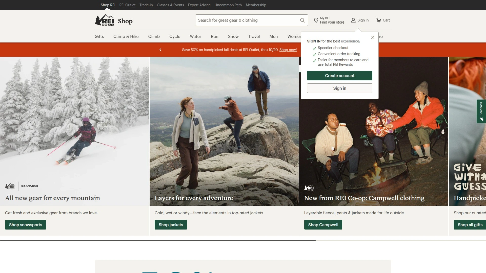

- Extensive in-house line plus major brands, clear specs, and helpful fit guides speed decisions for new and expert users alike.
- Returns are among the most generous in the category, reducing risk on bigger purchases like packs, tents, and footwear.

## [Backcountry](https://www.backcountry.com)

Backcountry shines for technical apparel, snowsports, and broad brand coverage, with fast shipping thresholds and responsive chat support for quick answers.

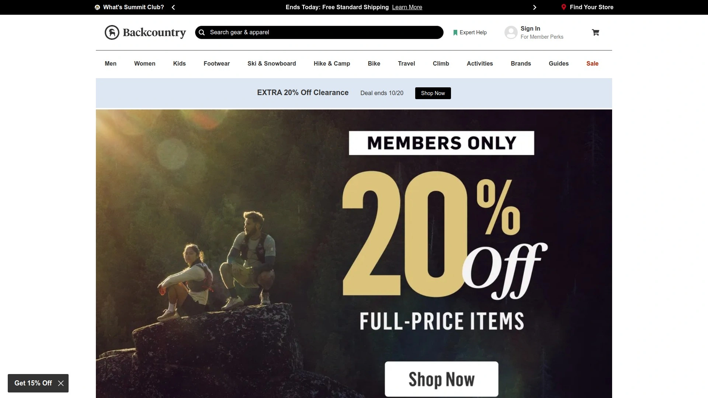

- Past-season colorways and frequent deals make it a go-to for value without sacrificing performance tiers.
- The catalog depth helps when sizing, specs, and model-year nuances really matter for alpine or backcountry setups.

## [Public Lands](https://www.publiclands.com)

Public Lands brings a large, modern assortment across hiking, camping, and trail categories with a clean shopping flow and straightforward value.
- Clear brand and size coverage plus price matching helps control total cost when building or refreshing full kits.
- Useful for day hikers to weekend car campers wanting fast store pickup options where available.

## [Evo](https://www.evo.com)

Evo is a top pick for ski, snowboard, and mountain bike gear, with standout guides and sizing help that flatten the learning curve.

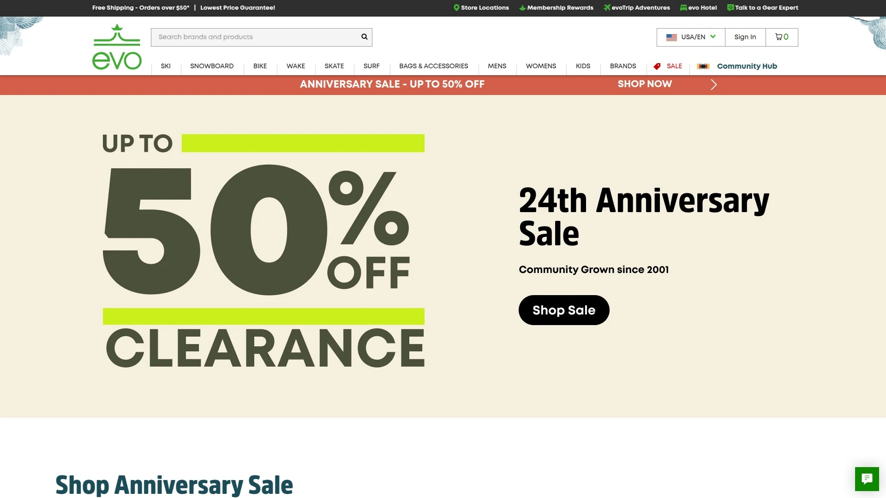

- Free shipping thresholds, predictable inventory status, and long return windows make seasonal upgrades less stressful.
- Ideal when winter gear specs and compatibility details are critical to performance and safety.

## [REI Outlet](https://www.rei.com/outlet)

REI Outlet collects discounted gear with clear filtering and reliable product info so bargain-hunting stays quick and low-risk.

- Same trusted experience as the main store with changing deals that reward regular check-ins.
- Best for budget-minded shoppers who still want accurate specs and an organized browsing experience.

## [Steep & Cheap](https://www.steepandcheap.com)

Owned by Backcountry, Steep & Cheap offers time-sensitive and seasonally rotated discounts on major outdoor brands for fast savings wins.

- “Current Steals” and alerts make it easy to catch price drops without manual refreshes all day.
- Strong option when you know exact models and sizes and want maximum markdowns.

## [CampSaver](https://www.campsaver.com)

CampSaver mixes mainstream and boutique brands with aggressive discount windows and transparent stock status for frictionless browsing.
- Particularly good for camping, trail, and shoulder-season apparel when timing sales right matters.
- A practical place to compare materials, weights, and alternative brands not always stocked elsewhere.

## [Sierra](https://www.sierra.com)

Formerly Sierra Trading Post, Sierra delivers consistent low prices on outdoor clothing and gear if you’re flexible on season and colorways.
- Clear product details help offset typical clearance limitations on sizes and inventory depth.
- Best for cost-first shoppers building casual hiking or car-camping kits.

## [Enwild](https://www.enwild.com)

Enwild focuses on backpacking, camping, and trail running with helpful educational content and friendly policies that reduce buyer hesitation.

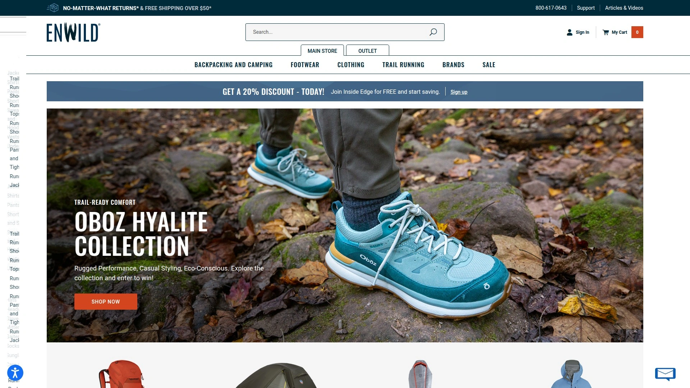

- Strong video content and explanations support confident choices on tents, packs, and sleep systems.
- Good for users who like guidance before committing to bigger-ticket items.

## [Campmor](https://www.campmor.com)

Campmor covers a wide range of outdoor basics with a straightforward site and deals that reward comparison-minded buyers.

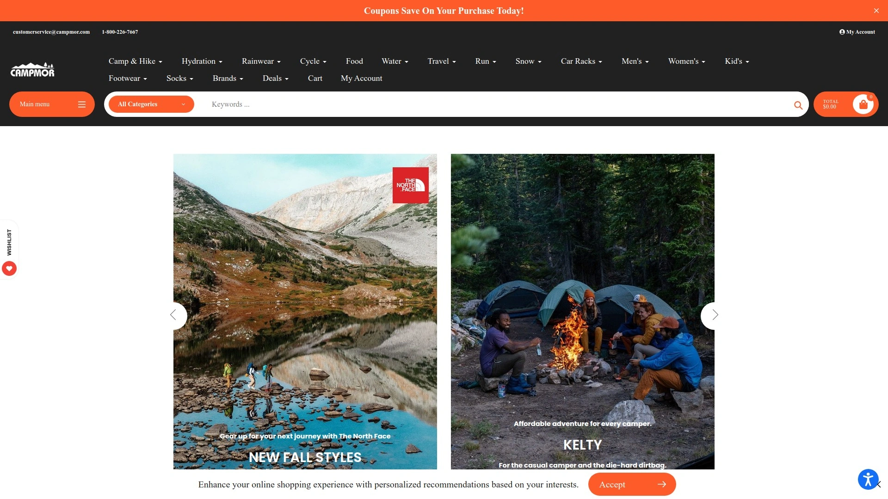

- Better fit for car camping and casual backpacking where value and simplicity beat chasing the newest tech.
- Reliable place to fill gaps after checking the larger hubs.

## [Eastern Mountain Sports](https://www.ems.com)

EMS is a Northeast mainstay with a broad catalog online and community resources that help new hikers ramp quickly.

- goEast editorial and skills content support planning and smart purchases for regional conditions.
- Strong generalist for East Coast day hikes, weekend trips, and shoulder seasons.

## [GO Outdoors](https://www.gooutdoors.co.uk)

A UK leader with different brand mixes and car‑camping depth that’s useful for travelers or those seeking alternative options.

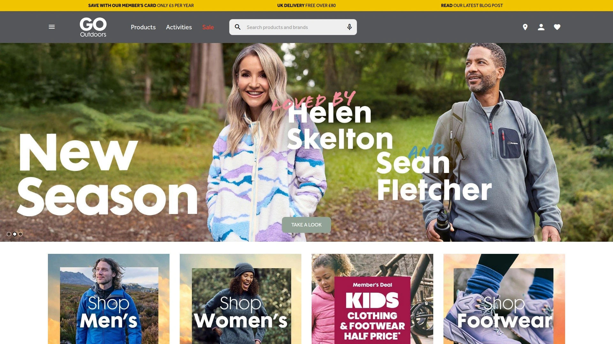

- Discount Card unlocks bigger periodic savings, with broad coverage for family camping and casual pursuits.
- Helpful when U.S. inventories are tight or when comparing international brand equivalents.

## [MEC](https://www.mec.ca)

MEC is Canada’s REI-style co‑op with rentals and a gear swap that extend coverage for occasional or try‑before‑you‑buy trips.

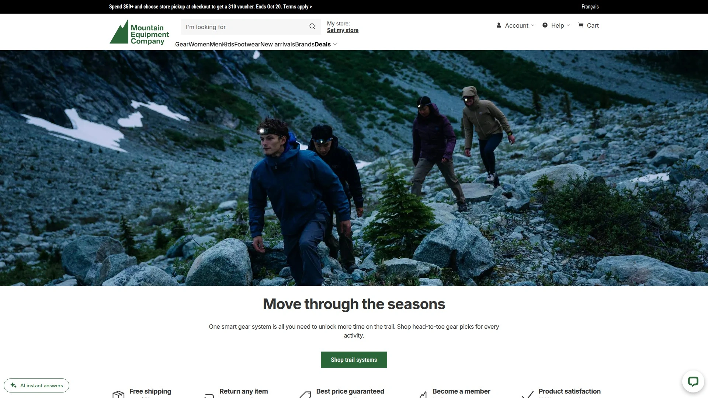

- Rentals can bridge gaps for specific trips while keeping budgets predictable.
- Shipping and availability policies are clear, aiding cross-border planning when needed.

## [Huckberry](https://huckberry.com)

Huckberry leans lifestyle-outdoor with curated apparel and everyday carry that pairs city life with trail weekends.

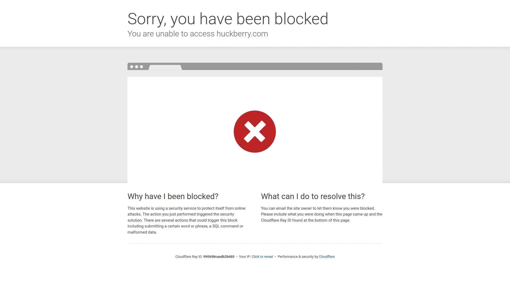

- Useful for versatile layers, boots, and accessories that transition smoothly from commute to campsite.
- A discovery-first experience if you value unique brands and design-forward picks.

## [Geartrade](https://www.geartrade.com)

Geartrade is a trusted used-gear marketplace that helps control costs and extend product life with straightforward browsing.

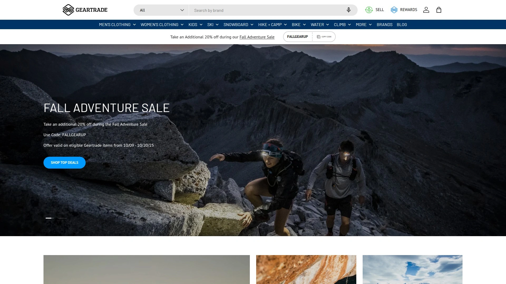

- Great for discontinued models or dialing in backups without overspending.
- Pairs well with mainline retailers when mixing new and used to finish a kit.

## [Amazon](https://www.amazon.com)

Amazon is unmatched for breadth and speed on smaller accessories and basics, though technical specs vary by listing.

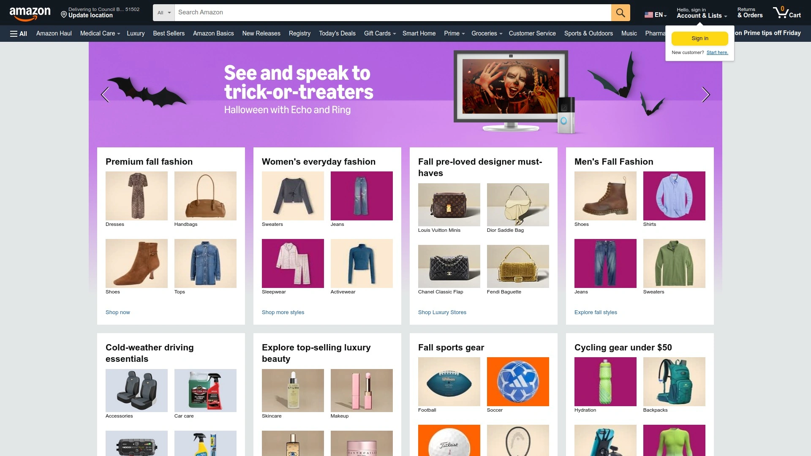

- Best for budget-friendly add‑ons, backups, and last‑minute items with fast delivery.
- For big-ticket technical gear, cross-check specs and model years before buying.

## [Tackle Warehouse](https://www.tacklewarehouse.com)

A dedicated bass fishing destination with massive selection on rods, reels, lines, and technique-specific tackle for serious anglers.

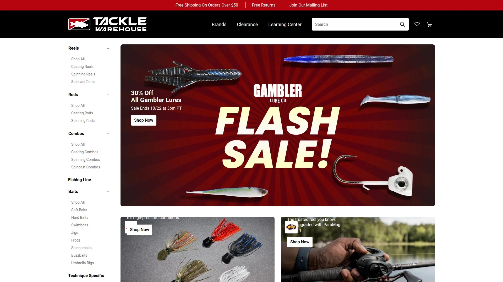

- Ideal when chasing niche presentations, regional patterns, or specific tournament-proven SKUs.
- Clear categorization speeds cart-building for seasonal switches and new lakes.

## [Discount Tackle](https://discounttackle.com)

A value-first fishing shop covering top brands with everyday savings that stretch a tackle budget further.

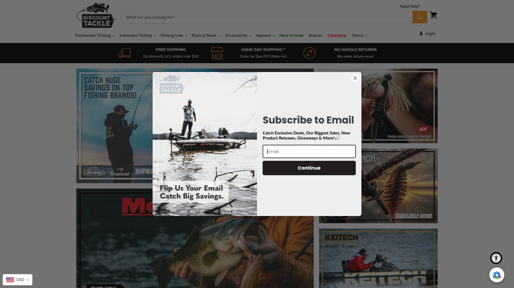

- Good for restocking staples like terminal tackle, soft plastics, and hardbaits without overthinking.
- Seasonal guides and content help target species transitions with minimal downtime.

## [Karl’s](https://shopkarls.com)

Karl’s blends discovery and savings for anglers, making it easy to sample new baits and refine confidence lures.

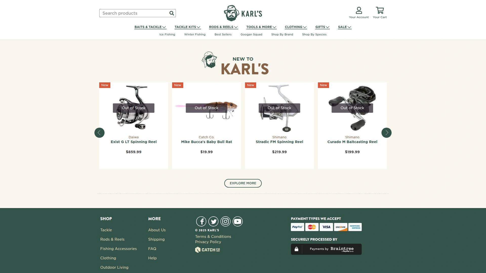

- Helpful for building species-specific boxes and keeping fresh options in rotation.
- A simple way to test trends before doubling down on bulk orders elsewhere.

***

### FAQ

- How do I pick the best outdoor gear retailer for my trip timeline and budget?
Start with shipping thresholds and return windows, then compare specs depth and brand coverage to balance speed with confidence on bigger purchases.

- What’s the fastest way to evaluate whether a retailer fits technical needs?
Check category guides, sizing charts, and policy clarity—sites like REI, Backcountry, and Evo publish robust help that reduces sizing and compatibility errors.

- Where do I find the best discounts without compromising quality?
Time seasonal clearances at REI Outlet, Steep & Cheap, Sierra, and CampSaver, and verify model years and sizes before checking out.

***

### Conclusion

For a smooth buying flow with wide coverage and steady costs, mix a generalist like REI or Backcountry with targeted outlets for timed savings and fishing specialists when needed.
Bass-first or bow-season focused shoppers will find [Bass Pro Shops](https://www.basspro.com) ideal thanks to deep selection across fishing and hunting with trusted in-store and online experiences.
Bookmark a couple of deal hubs and a primary all-rounder, and you’ll keep kits updated faster, cheaper, and with fewer return headaches all year.
